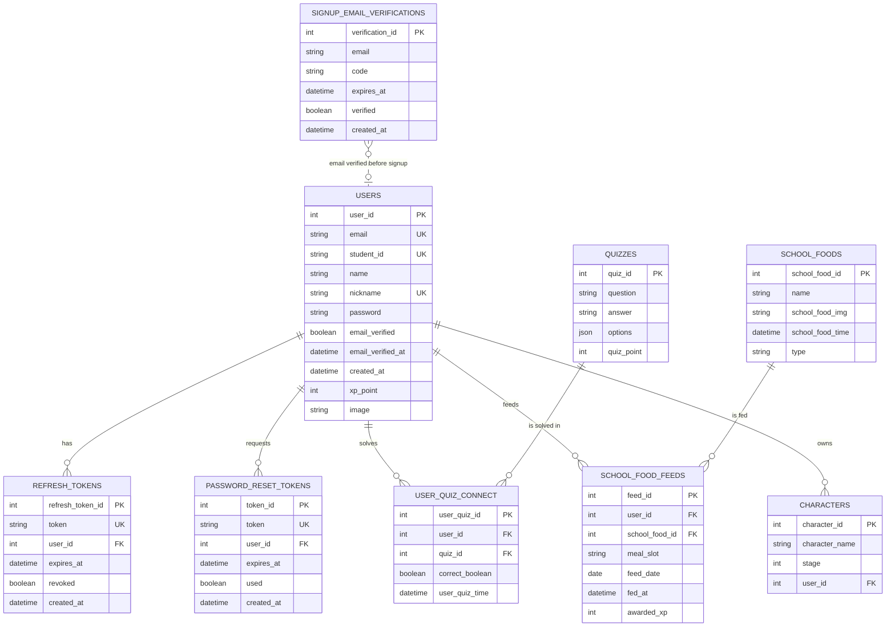

# Boo키우기 ERD

## Relationship Summary

- `users` 1:N `refresh_tokens`
- `users` 1:N `password_reset_tokens`
- `users` N:M `quizzes` through `user_quiz_connect`
- `users` N:M `school_foods` through `school_food_feeds`
- `users` 1:N `characters`
- `signup_email_verifications` is logically connected to `users.email`, but it has no FK because it is used before user creation.

