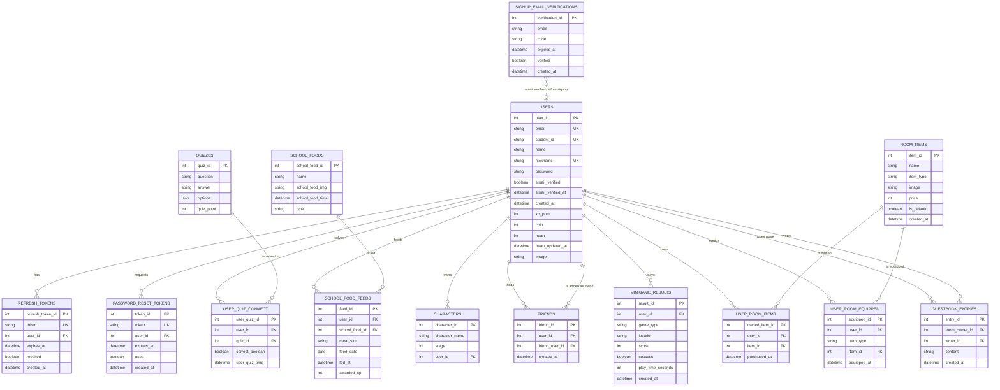

# Boo키우기 ERD

## Relationship Summary

- `users` 1:N `refresh_tokens`
- `users` 1:N `password_reset_tokens`
- `users` N:M `quizzes` through `user_quiz_connect`
- `users` N:M `school_foods` through `school_food_feeds`
- `users` 1:N `characters`
- `users` N:M `users` through `friends`
- `users` 1:N `minigame_results`
- `users` N:M `room_items` through `user_room_items`
- `users` N:M `room_items` through `user_room_equipped`
- `users` 1:N `guestbook_entries` as room owner
- `users` 1:N `guestbook_entries` as writer
- `signup_email_verifications` is logically connected to `users.email`, but it has no FK because it is used before user creation.

## Constraints

- `users.email` is unique.
- `users.student_id` is unique.
- `users.nickname` is unique.
- `refresh_tokens.token` is unique.
- `password_reset_tokens.token` is unique.
- `user_quiz_connect` has unique `(user_id, quiz_id)`.
- `school_food_feeds` has unique `(user_id, feed_date, meal_slot)`.
- `friends` has unique `(user_id, friend_user_id)`.
- `user_room_items` has unique `(user_id, item_id)`.
- `user_room_equipped` has unique `(user_id, item_type)`.
